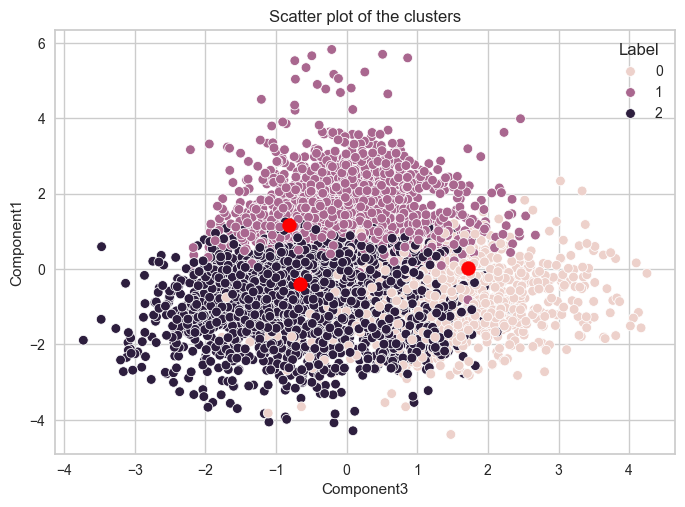

# Adult Data Analysis using Clustering

## Clustering




Clustering is a technique in machine learning and data analysis that involves grouping similar data points together based on certain features or characteristics. The goal of clustering is to partition a dataset into groups, or clusters, in such a way that the data points within a cluster are more similar to each other than to those in other clusters. This helps identify patterns, structures, or relationships within the data.

### **Key points about clustering**:

**Unsupervised Learning**: Clustering is typically an unsupervised learning task, meaning that the algorithm does not rely on labeled data with predefined categories. Instead, it identifies patterns or groupings based solely on the inherent structure of the data.

**Similarity Metric**: Clustering algorithms use a similarity metric to measure how close or similar data points are to each other. The choice of similarity metric depends on the nature of the data and the specific requirements of the analysis.

**Objective**: The primary objective of clustering is to maximize intra-cluster similarity and minimize inter-cluster similarity. In other words, points within the same cluster should be more similar to each other, and points in different clusters should be less similar.

### **Common Algorithms**:

1. **K-Means**
2. **Hierarchical Clustering**
3. **DBSCAN (Density-Based Spatial Clustering of Applications with Noise)**
4. **Agglomerative Clustering**:

### Applications:

* Customer segmentation in marketing.
* Image segmentation in computer vision.
* Anomaly detection in cybersecurity.
* Document clustering in natural language processing.
* Genomic clustering in bioinformatics.

Clustering is a versatile technique used across various domains to uncover patterns, discover hidden structures, and gain insights into the underlying organization of data.


**K-Means**: A popular centroid-based clustering algorithm that partitions the data into a specified number (k) of clusters. It aims to minimize the sum of squared distances between data points and the centroid of their assigned cluster


#### The dataset


|| Variable | Type | Missing Values |
| --- | --- | --- | --- |
|1| age	| Integer	| no |
|2| workclass | Categorical | yes |
|3| fnlwgt	| Integer	| no |
|4| education	| Categorical	|	no |
|5| education-num	| Integer	|	no |
|6| marital-status	|	Categorical |	no |
|7| occupation	|	Categorical	| yes |
|8| relationship	|	Categorical	|	no |
|9|race | Categorical |	no |
|10| sex	| Binary	| no |
|11|capital-gain |	Integer			|	no |
|12|capital-loss |	Integer			|	no |
|13|hours-per-week|	Integer		|		no |
|15|native-country	|	Categorical	| no |
|16|income |	Binary	| no |

<br>

### Credits
```
  author       = Becker,Barry and Kohavi,Ronny,
  title        = Adult,
  year         = 1996,
  publishedby  = UCI Machine Learning Repository,
  DOI          = https://doi.org/10.24432/C5XW20
```

This notebook is all about carrying out clustering analysis on the Adult dataset to find possible clusters.

## Procedure

1. Carried out data cleaning and pre-processing.
2. Did PCA analysis on the dataset
3. Found the number of clusters
4. Used KMeans algorithm to the train the dataset
5. Discussed the result


After the analysis, I discovered there are 3 major  clusters, and I further analyzed this to discover have a theory that clusters were created based on the Financial Capability

* Class 0: They are majorly the Widowed, Divorced, Separated, Married spouse absent, Married-AF-Spouse 
* Class 1 : They are majorly married
* Class 2: They are majorly people that are never married